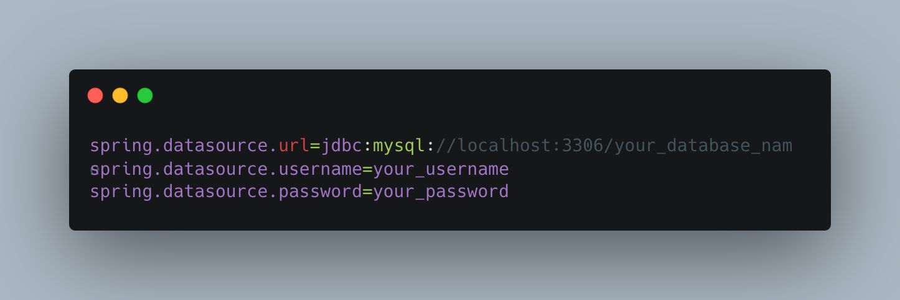

# Description:

Introducing a revolutionary web application that seamlessly connects car enthusiasts and skilled mechanics. Our platform
empowers users to effortlessly post their car questions on an open forum while conveniently searching for trusted
mechanics in their local area. With integrated private messaging, hassle-free appointment booking, and secure payment
options, our application transforms the way car owners interact, ensuring a smooth and efficient automotive experience
like never before
***

##  Live Site: [Auto-Connect](https://www.auto-connect.org)
***

## 🧰 Languages and Tools

***

 

# Web Page Usages

***
The project provides the following functionality to users:

### Asking Car Related Questions

Users can create posts to ask car-related questions on the forum. This feature allows users to seek advice, share
knowledge, and engage in discussions with other community members.

### Commenting on Posts

Other users can post comments to answer questions on the forum. This interactive feature fosters collaboration and
enables users to provide helpful insights and solutions to the queries raised by others.

### Searching for Mechanics

The application allows users to search for mechanics in their local area. By leveraging location data, users can easily
find mechanics who are conveniently located and accessible for their car service needs.

### Private Messaging with Mechanics

Users can initiate private conversations with mechanics to discuss specific details of their service requirements. This
feature enables direct communication and facilitates personalized discussions between users and mechanics.

### Payment System

Customers can click on their specific calendar appointment and make payments within the application

### Creating Appointments

Mechanics have the ability to create appointments on a shared calendar. These appointments are then rendered on both the
mechanic's calendar and the customer's calendar. Customers can view appointment details on their own calendar on profile
page.

### Making Reviews

After receiving service, customers can provide personalized reviews on the mechanic's profile page. This includes a star
rating and a description of their service experience. These reviews help other users make informed decisions when
choosing a mechanic and contribute to building a reputable community.

## Installation and Setup Instructions

***

<strong>Prerequisites:</strong> Ensure that you have the following prerequisites installed on your machine:

* Java Development Kit (JDK)
* Maven (for dependency management)
* MySQL (relational database management system)

**1.Clone down this repository**

**2.Configure the APIs:** Obtain API keys or credentials for the three APIs and update the application properties files in
the project.

* [Stripe API](https://stripe.com/docs/keys)
* [Cars API](https://rapidapi.com/principalapis/api/car-data/pricing/)
* [MapBox API](https://www.mapbox.com/)

Open the application.properties file in the project.
Find the properties related to each API (e.g., stripe.api.key, cars.api.key, mapbox.api.key).
Replace the placeholder values with your actual API keys.

**3.Set up MySQL Database**

Install MySQL on your machine if you haven't already.
Create a new database for the project.
Update the database configuration in the application.properties file with your MySQL database details.

**4.Install Dependencies:**
To install the project dependencies, navigate to the project root directory and run the following command:

`mvn install`

**5.To Start Server:**
To start the server, run the following command:

`mvn spring-boot:run`

**6.To Visit App:**
Once the server is running, you can access the application by opening your web browser and navigating to:

`http://localhost:8080/`

# Contributors

***
Savanna McCauley:

  

Yong :

  

Miguel:

  

Amir:

  

